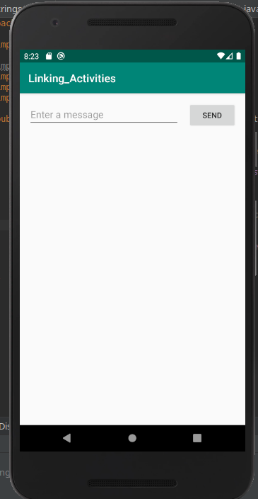
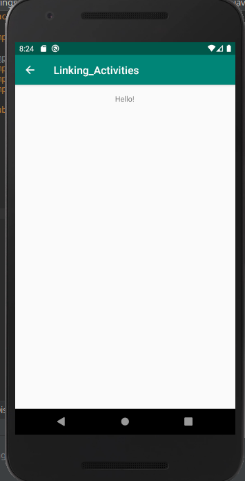

Linking activities in android studio 

The main objective is to demonstrate how to pass data between different activities. 

What is an activity? 
An activity is an application component that provides a screen with which users can interact in order to do something, such as dial the phone, take a photo, send an email, or view a map. Each activity is given a window in which to draw its user interface.

Requirements:

Current version:
  1) Android Studio Version 3.5.2
  2) Android SDK tool Version 26.1.1
  3) Virtual device used = "Nexus 5X API 29 x86"
  
  
  

If you take a look at the layout XML files in this path:
Linking_Activities/app/src/main/res/layout/
It will show you how to create the text box, button and text view. 

